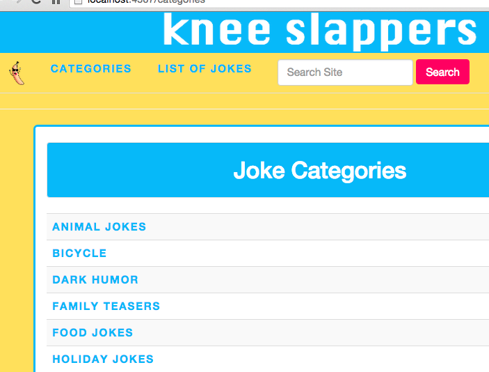

# _Knee Slappers_

##### A joke machine with hilarity rating. Date of current version: 09/10/15

#### By **Nataliya Bareeva-Miller, Aimee Reiss, Jennifer Morkunas, and Diana Holland**

## Description

In this joke machine, you can add your favorite jokes, and then rate other jokes. Sometimes it's hard to know when a joke is funny or not, and this app helps solve that problem! The database can support jokes with multiple categories, and categories with multiple jokes.

## Setup

* Download and intall the Java Standard Development Kit
* Download and install the Java Runtime Environment
* Run ```$ java -version``` to make sure everything's installed correctly
* To manage this project's dependencies, download and install Gradle . If you're using Homebrew, just type ```$ brew install gradle```
* To run this project, first setup the local database (instructions below). Then connect to this folder in terminal and type ```gradle run```.

**To use the database included with this file, follow these instructions:**

* Clone this git repository on your computer ```git clone https://github.com/nifferdil/Joke-Project.git```
* In terminal, start the PostgreSQL server by typing ```postgres``` and ```psql```
* In psql, create a new database by typing ```CREATE DATABASE knee_slappers;```
* In another tab in terminal, connect to this project folder: ```cd path/to/this/folder```
* In this tab, dump the database information from our sql file into your local database by typing the following code: ```psql knee_slappers < knee_slappers.sql```

* To run tests, you can create a new test database in psql: ```CREATE DATABASE knee_slappers_test WITH TEMPLATE knee_slappers;```

## Database Schema


## Technologies Used

Java, Apache Spark and Velocity templates, PostgreSQL Database, HTML5, and CSS3

## UI



### Legal

Copyright (c) 2015 **Nataliya Bareeva-Miller, Aimee Reiss, Jennifer Morkunas, and Diana Holland**

This software is licensed under the MIT license.

Permission is hereby granted, free of charge, to any person obtaining a copy
of this software and associated documentation files (the "Software"), to deal
in the Software without restriction, including without limitation the rights
to use, copy, modify, merge, publish, distribute, sublicense, and/or sell
copies of the Software, and to permit persons to whom the Software is
furnished to do so, subject to the following conditions:

The above copyright notice and this permission notice shall be included in
all copies or substantial portions of the Software.

THE SOFTWARE IS PROVIDED "AS IS", WITHOUT WARRANTY OF ANY KIND, EXPRESS OR
IMPLIED, INCLUDING BUT NOT LIMITED TO THE WARRANTIES OF MERCHANTABILITY,
FITNESS FOR A PARTICULAR PURPOSE AND NONINFRINGEMENT. IN NO EVENT SHALL THE
AUTHORS OR COPYRIGHT HOLDERS BE LIABLE FOR ANY CLAIM, DAMAGES OR OTHER
LIABILITY, WHETHER IN AN ACTION OF CONTRACT, TORT OR OTHERWISE, ARISING FROM,
OUT OF OR IN CONNECTION WITH THE SOFTWARE OR THE USE OR OTHER DEALINGS IN
THE SOFTWARE.
